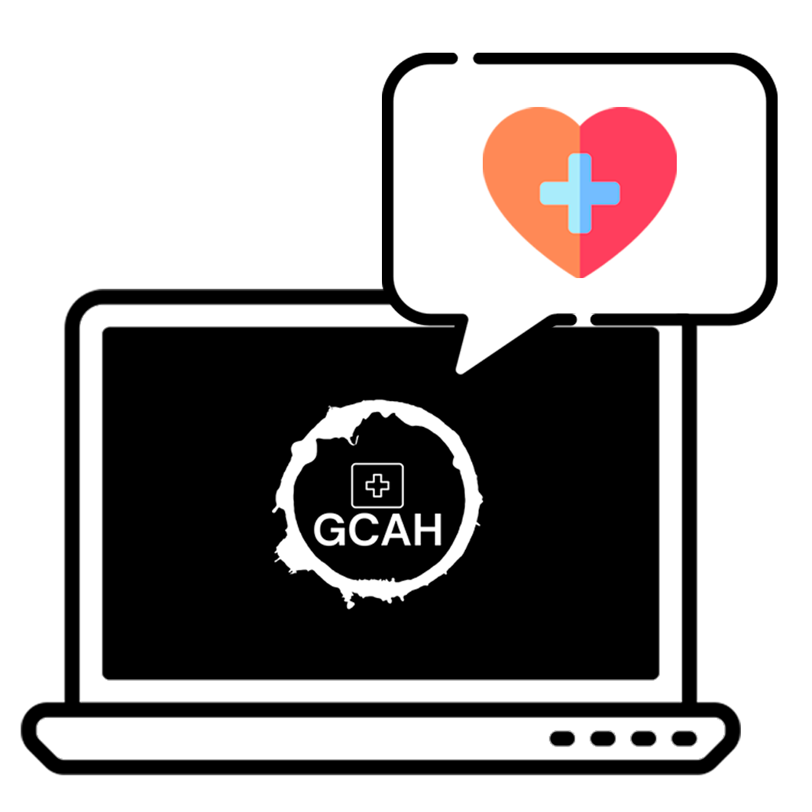

<h1 align="center"> GCAH - Gestor de equipes de Cuidado e Assistência Hospitalar </h1>

Projeto UC: Usabilidade, Desenvolvimento Web, Mobile e Jogos 3º Período - ADS - UNA Contagem

  <a href="#-tecnologias">Tecnologias</a>&nbsp;&nbsp;&nbsp;|&nbsp;&nbsp;&nbsp;
  <a href="#-gcah">GCAH</a>&nbsp;&nbsp;&nbsp;|&nbsp;&nbsp;&nbsp;
  <a href="#-usuários">Usuários</a>&nbsp;&nbsp;&nbsp;|&nbsp;&nbsp;&nbsp;
  <a href="#memo-licença">Licença</a>

  

## 🚀 Tecnologias

Esse projeto foi desenvolvido com as seguintes tecnologias:

- HTML e CSS
- JavaScript
- Git e Github

## 🤔 GCAH

O GCAH é uma ferramenta de gestão da equipe de Cuidado e Assistência Hospitalar,
tem por finalidade assegurar a realização das atividades e a continuidade destas, na
Passagem de Plantão.

## 👩‍🔬 Usuários

O GCAH é destinado aos seguintes usuarios: Coordenador da Equipe de Enfermagem;
Enfermeiros; Técnicos de Enfermagem e Auxiliares Técnicos de Enfermagem.

## :memo: Licença

Esse projeto está sob a licença Apache 
